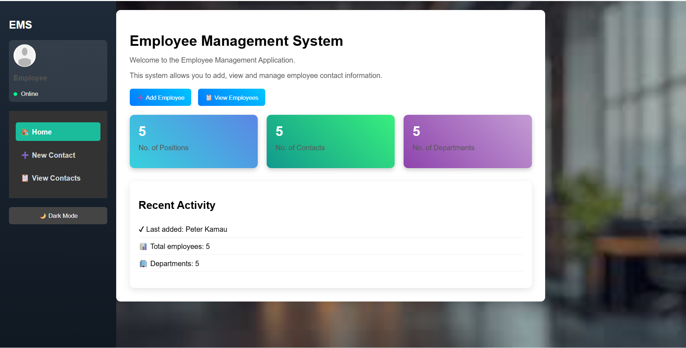
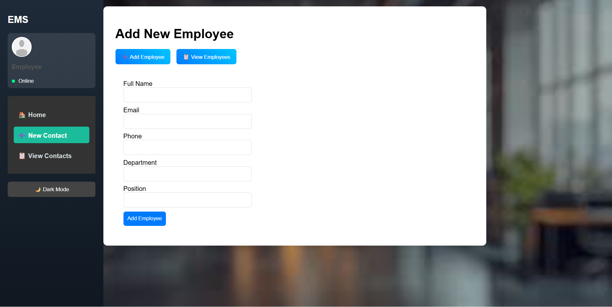
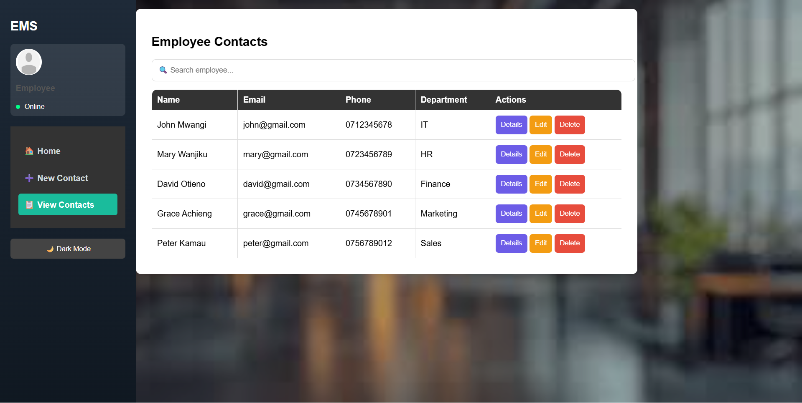

# Employee Management System (EMS)

## 📌 Overview
This is a simple Employee Management System built using HTML, CSS, and JavaScript.  
It allows users to add, view, and manage employee contact information through a clean dashboard interface.

---

## 🚀 Features
- Dashboard with employee statistics
- Add new employee details using a form
- View all employees in a table
- Search employees instantly
- Sidebar navigation across all pages
- Recent activity section
- Dark mode toggle (🌙 / ☀️)
- Responsive and modern UI design

---

## 🛠️ Technologies Used
- HTML
- CSS
- JavaScript (Local Storage)

---

## 💡 How It Works
- Employee data is stored in the browser using **localStorage**
- Sample employees are automatically loaded for demonstration
- Any new employees added will be saved locally in your browser

---

## ⚠️ Note
Data added in the system is stored locally in the browser and will **not appear on GitHub**.  
This is because localStorage is specific to each user’s browser.

---

## 📷 Screenshots

### Dashboard

### Add Employee

### View Contacts

---

## 👨‍💻 Author
- SAM KOGEI

---

## 📅 Project Purpose
This project was developed as part of coursework to demonstrate:
- Frontend development skills
- UI/UX design
- JavaScript functionality